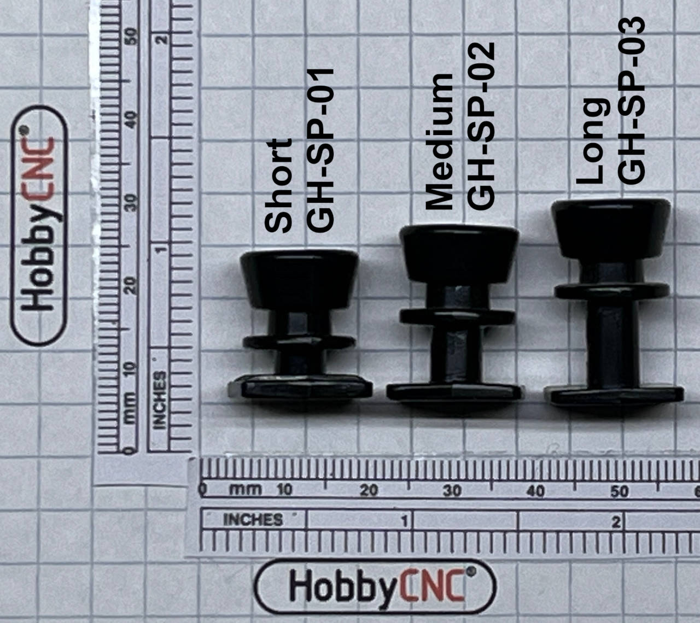
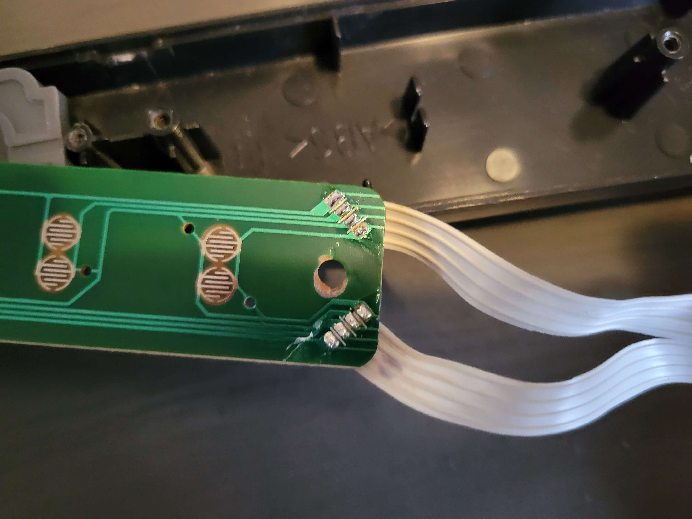
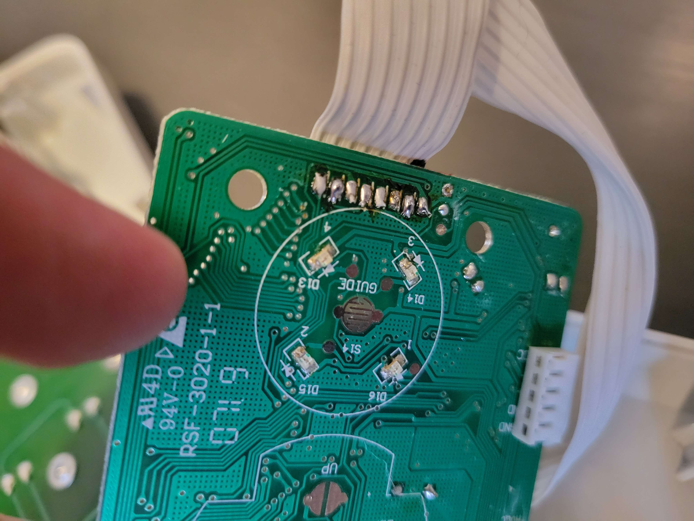

I recently bought an untested Guitar Hero X-Plorer controller from eBay. The description stated it didn't have a breakaway cable, and there was a rattling noise coming from inside. No breakaway cable was not a big deal, and it otherwise sounded serviceable, So I decided to see what I could do with it.

When it first arrived, it was pretty dirty all around, so I disassembled it completely and deep-cleaned it. I found that the ratting sound came from part of the bottom guitar strap button which had broken off at some point. From what I can tell, the X-Plorer uses the smallest of the three button sizes (image from [HobbyCNC](https://hobbycnc.com/)):

After cleaning the shell and all of the contacts with isopropyl alcohol, I made the mistake of totally reassembling it before testing it. Using Windows' joy.cpl input tester, I found that the red fret was showing constantly pressed despite not being physically pressed, and having just been cleaned. As well, when holding the yellow and blue frets down, the green fret was being shown as pressed. I figured there must have been an issue with the connection between the fret board and the main board. To try resolving this, I reflowed the solder joints for the ribbon cable on both the fret board and the main board.

Not the cleanest possible work, but it's good enough for now. In this case, the issue ended up being the connections on the main board, but I tried the fret board first, so I hopefully shouldn't have to worry about either of those for a while.

This was a pretty neat project and a fairly simple fix. I'm not sure how much Guitar Hero I'm going to play, but it was nice to bring an old controller back to life and practice some soldering on a low-risk project. All it needs now is a replacement strap button and any guitar strap, and it should be good to go.
